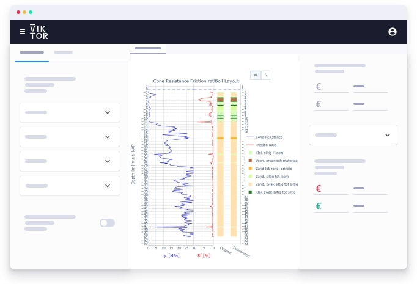

 <Please check version is the same as specified in requirements.txt>

# Title of App (concept that it is trying to show)
This sample app shows ... <basic one line intro here>

More elaborate description here. Lorem ipsum dolor sit amet, consectetur 
adipiscing elit. Vivamus libero leo, pellentesque ornare, adipiscing vitae, 
rhoncus commodo, nulla. Fusce quis ipsum. Nulla neque massa, feugiat sed, 
commodo in, adipiscing ut, est. In fermentum mattis ligula. Nulla ipsum.


 <Please update the background image in the manifest to something relevant to the app>

## App structure <please provide if more than a single entity type is present>

```
Universe: has a controller but no parametrization so has no editor
  └─ System: has a controller and a parametrization 
     ├── Analysis: 
     │     ├── controller with a WebAndDataView: uses data from System and Planet
     │     └── parametrisation with a SiblingOptionField:  retrieves info from Planet
     └── Planet:   
           ├── controller with no view
           └── Planet: has a controller and a parametrization            
```
