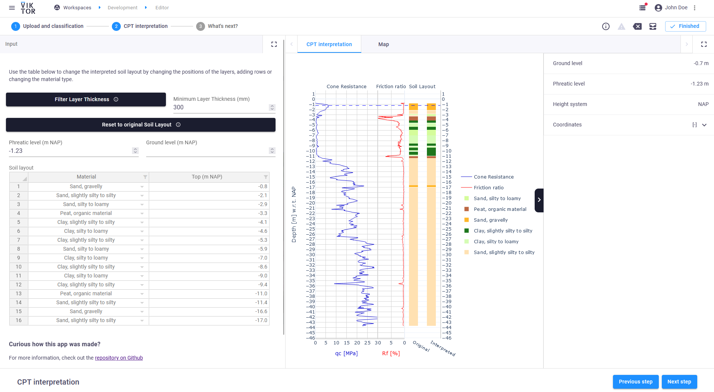
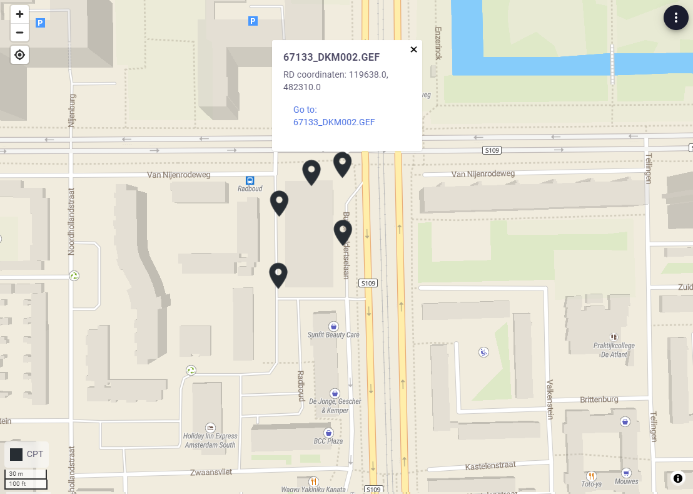

 <Please check version is the same as specified in requirements.txt>

# CPT interpretation with Robertson
This sample app shows  show how to interpret a CPT (.gef) to a soil layout using the Robertson method. <basic one line intro here>

This app can consist of multiple projects with multiple cpt files. The first picture is an example of such a cpt file. On the left there is the input where the minimum layer thickness can be defined. 
On the right the soil layer interpretation is shown with its data.



Then on picture 2 a map overview of all the cpt locations can be seen.



Here is a gif doing the folowing tasks: 
- create a project
- upload a .gef file as cpt
- adjust some parameters in the cpt interpretation
- view the location of the cpt on the map


## App structure <please provide if more than a single entity type is present>

```
project_folder: has projects as its children
  └─ project: has cpt files as its children and can visualize those cpts on a map
     └── cpt_file: intrepretation of a CPT file using the Robertson method  
```
